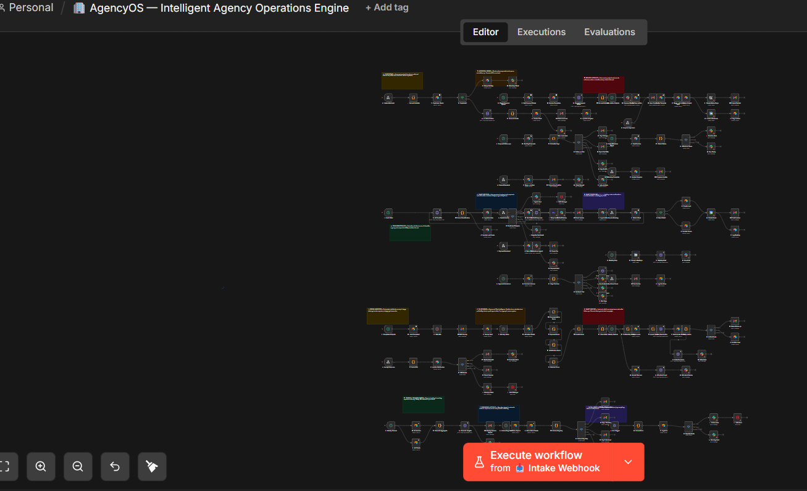
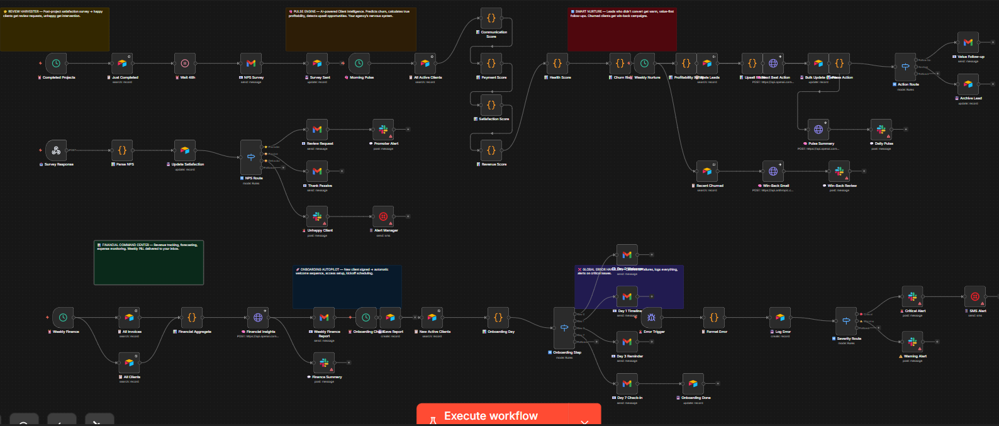
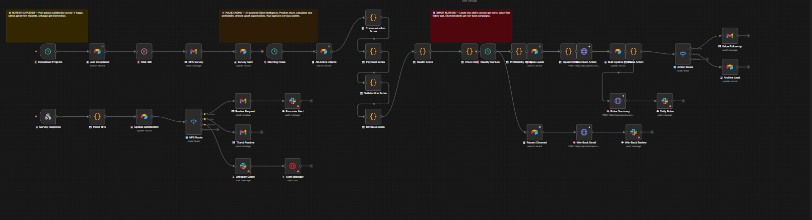
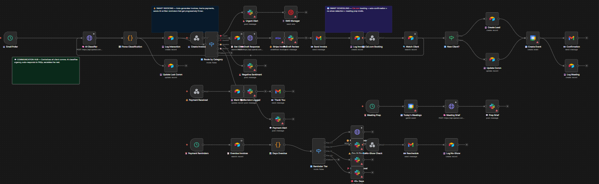

# AgencyOS — Intelligent Agency Operations & Retention Engine

An end-to-end operational automation engine built in n8n for digital agencies and service-based businesses. 

AgencyOS unifies client onboarding, project execution, automated invoicing, customer health monitoring, and proposal generation into a single event-driven system with **12 modular subsystems** and **155 functional nodes**.

---

## System Architecture

```
┌────────────────────────────────────────────────────────────────────────┐
│                        AGENCYOS — 12 MODULES                           │
├──────────────────────────────────┬─────────────────────────────────────┤
│  CLIENT LIFECYCLE & INTAKE       │  OPERATIONS & INTELLIGENCE          │
│                                  │                                     │
│  M01 · Client Intake             │  M07 · Review Harvester             │
│  M02 · Proposal Engine           │  M08 · Pulse Engine (Health Radar) │
│  M03 · Project Autopilot         │  M09 · Lead Nurture                 │
│  M04 · Communication Hub         │  M10 · Financial Operations         │
│  M05 · Invoicing & Payments      │  M11 · Client Onboarding            │
│  M06 · Scheduling Engine         │  M12 · Global Error Handler         │
└──────────────────────────────────┴─────────────────────────────────────┘
```



---

## Core Innovations

### 1. Deterministic Client Health Scoring (Pulse Engine™)
Unlike black-box AI scoring, the Pulse Engine calculates a **composite health score (0–100)** using four deterministic operational signals:

$$\text{Health Score} = w_1 \cdot C_{\text{freq}} + w_2 \cdot P_{\text{velocity}} + w_3 \cdot S_{\text{nps}} + w_4 \cdot R_{\text{margin}}$$

- **Communication Cadence ($C_{\text{freq}}$):** Detects sudden drops in interaction volume.
- **Payment Velocity ($P_{\text{velocity}}$):** Tracks days-to-pay trends against baseline averages.
- **Revision Ratio ($S_{\text{nps}}$):** Measures revision rounds per milestone.
- **Margin Health ($R_{\text{margin}}$):** Calculates tracked hours versus contract value.

```
┌──────────────────────────────────────────────────────────────┐
│                  HEALTH SCORE CLASSIFICATION                │
├──────────────────────────────────────────────────────────────┤
│  🟢 80–100 (Healthy)  · Standard operations                  │
│  🟡 50–79  (Watch)    · Trigger preemptive check-in          │
│  🔴 0–49   (Critical) · Escalate to Account Lead (HITL)     │
└──────────────────────────────────────────────────────────────┘
```

### 2. Cold-Start Calibration Protocol
To prevent false alarms during initial deployment, the engine executes a **30-day calibration cycle**:
- **Days 1–30:** All clients initialized at baseline (70). Data collection mode without automated warnings.
- **Days 31–60:** Initial trend detection enabled with confidence metrics attached to alerts.
- **Days 60+:** Full predictive churn detection enabled.

### 3. Cost-Optimized LLM Routing

| Task | LLM Model | Cost Rationale |
|------|-----------|----------------|
| Email Classification & Routing | `GPT-4o-mini` | Low complexity, high frequency ($0.15/1M tokens) |
| Payment Reminder Drafting | `GPT-4o-mini` | Template-guided extraction |
| Daily Pulse Briefing Synthesis | `GPT-4o-mini` | Structured JSON generation |
| Proposal Generation | `Claude 3.5 Sonnet` | Complex document reasoning & domain adaptation |

---

## Subsystem Specifications



### M01 · Client Intake
Validates web form submissions, parses project scope parameters, and seeds new client records in Airtable.

### M02 · Proposal Engine
Extracts requirements from discovery briefs and utilizes **Claude 3.5 Sonnet** to generate structured proposal drafts. Requires mandatory human review before dispatch.

### M03 · Project Autopilot
Automates project creation in task management tools (Asana/ClickUp), generates milestone checklists, and dispatches weekly status updates.

### M04 · Communication Hub
Centralizes inbound email and Slack communications. Categorizes messages into `URGENT`, `QUESTION`, `REVISION`, or `FEEDBACK`.



### M05 · Invoicing & Payment Tracking
Generates Stripe/Staggered invoices upon milestone completion. Executes automated escalation sequences for overdue balances (3d, 7d, 14d).

### M06 · Scheduling Engine
Coordinates calendar availability for client syncs and discovery calls using Calendly/Google Calendar webhooks.

### M07 · Review Harvester
Triggers automated post-project NPS surveys. High scores (≥9) prompt automated requests for Google/Trustpilot reviews.

### M08 · Pulse Engine (Retention Radar)
Runs daily batch analysis over communication logs and invoice histories. Generates executive briefings detailing churn risks and upsell candidates.



### M09 · Lead Nurture
Manages re-engagement cadences for dormant leads and past clients based on lifecycle triggers.

### M10 · Financial Operations
Aggregates monthly recurring revenue (MRR), outstanding receivables, and contractor expenses into summary reports.

### M11 · Client Onboarding
Dispatches welcome kits, NDA contracts (DocuSign), and asset submission forms automatically upon invoice payment.

### M12 · Global Error Handler
Traps unhandled exceptions across all 11 modules, logs error stack traces to database, and posts urgent alerts to Slack `#system-alerts`.

---

## Human-in-the-Loop (HITL) Checkpoints

The system incorporates **11 mandatory human verification gates**:

| Module | Gate | Purpose |
|--------|------|---------|
| M02 | Proposal Approval | Review LLM-generated scope & pricing prior to client send |
| M04 | Urgent Communication Escalation | Verify emergency client queries before response |
| M05 | Manual Payment Override | Validate manual wire transfers or custom terms |
| M08 | Churn Risk Action Plan | Account Lead sign-off on retention intervention |
| M08 | Upsell Outreach Approval | Review proposed service expansion briefs |
| M11 | NDA / Contract Customization | Legal sign-off on non-standard client contracts |

---

## System Integrations

| Subsystem | Service / API | Role |
|-----------|---------------|------|
| Database / State Engine | Airtable | Centralized record store |
| Primary AI Reasoning | OpenAI GPT-4o-mini | Scoring, classification, briefing synthesis |
| Proposal Generation AI | Anthropic Claude 3.5 Sonnet | Structured proposal drafting |
| Messaging & Telemetry | Slack / Email | Staff alerts & transactional communications |
| Billing & Payments | Stripe API | Invoice generation & payment webhooks |
| Contract E-Signatures | DocuSign | Automated NDA & agreement signing |

---

## Setup & Deployment

### Prerequisites
- n8n instance (v1.0+)
- Airtable workspace configured with AgencyOS relational schema (`Clients`, `Projects`, `Invoices`, `Interactions`, `PulseLogs`)

### Installation
1. Open n8n editor.
2. Select **+ New Workflow** → **Import from file**.
3. Import `AgencyOS-Workflow.json`.
4. Configure required API credentials in n8n Credential Store.

---

## File Manifest

| File | Description |
|------|-------------|
| `AgencyOS-Workflow.json` | Complete n8n workflow export (~155 nodes) |
| `README.md` | System specification and architecture documentation |
| `assets/canvas-full.png` | Full n8n canvas capture |
| `assets/canvas-part1.png` | Modules 01–04 detail capture |
| `assets/canvas-part2.png` | Modules 05–08 detail capture |
| `assets/canvas-part3.png` | Modules 09–12 detail capture |

---

## Author

**Amine Sellal** — Full Stack Developer & AI Automation Engineer  
[github.com/aminesellal](https://github.com/aminesellal) · [Portfolio](https://aminesellal.github.io/myportfolio)
