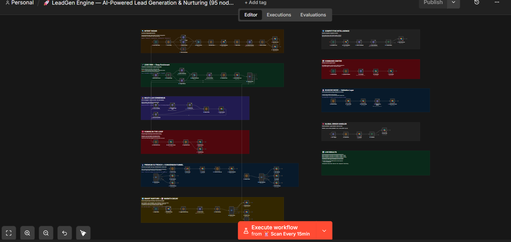
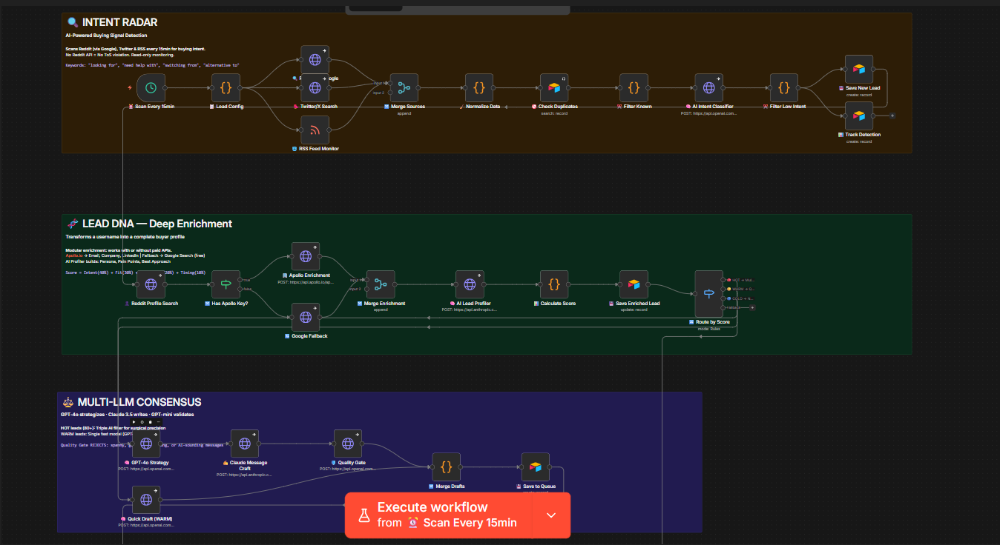
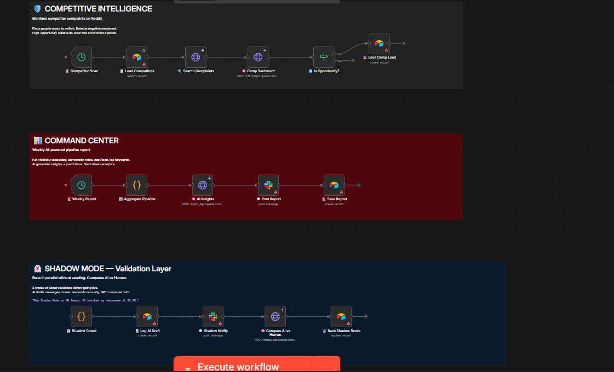
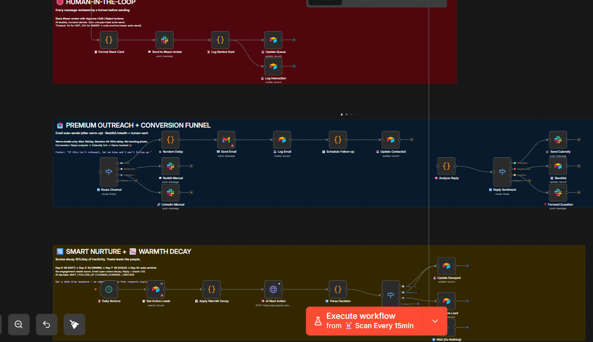
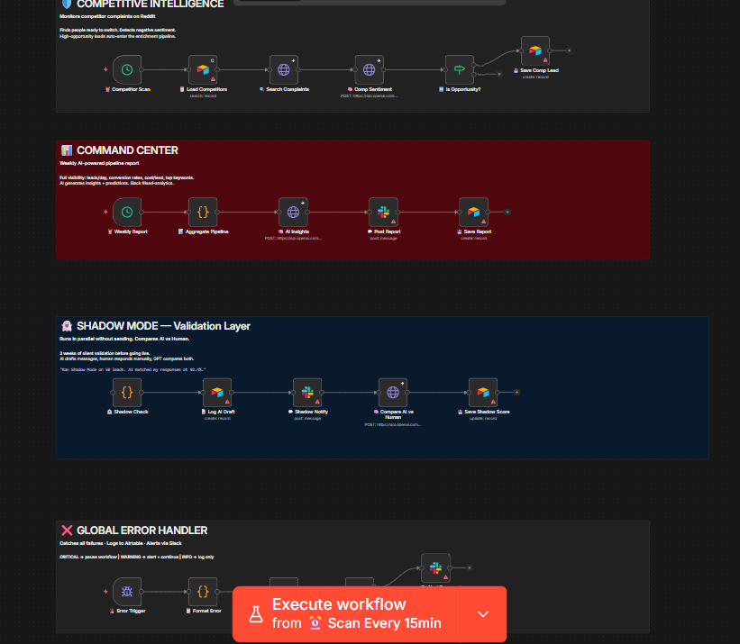

# LeadGen Engine — Multi-LLM Intent Radar & SDR Orchestration Architecture

An automated intent detection and AI-assisted Sales Development Representative (SDR) orchestration engine built in n8n. 

The system continuously monitors public channels for high-intent signals, scores lead relevance using multi-LLM consensus, enriches prospect metadata, and drafts personalized responses for mandatory human review before dispatch.

---

## Technical Philosophy

```
┌──────────────────────────────────────────────────────────────┐
│                    ARCHITECTURE CONSTRAINTS                  │
├──────────────────────────────────────────────────────────────┤
│  1. READ-ONLY INGESTION  · Ingests public intent signals     │
│                            via search & official APIs.       │
│  2. MULTI-LLM CONSENSUS  · Uses GPT-4o, Claude 3.5, and      │
│                            GPT-4o-mini in a 3-tier validation│
│                            pipeline to minimize hallucinations│
│  3. MANDATORY HITL GATE  · Zero automated messaging. All     │
│                            drafts require human Slack approval│
│  4. SHADOW MODE          · Offline benchmarking framework    │
│                            evaluating AI vs human accuracy   │
└──────────────────────────────────────────────────────────────┘
```

---

## System Architecture

```
                       ┌────────────────────────┐
                       │  ⏰ Cron Trigger (15m) │
                       └───────────┬────────────┘
                                   │
             ┌─────────────────────┼─────────────────────┐
             ▼                     ▼                     ▼
     ┌──────────────┐      ┌──────────────┐      ┌──────────────┐
     │ Google Search│      │ Twitter API  │      │  RSS Feeds   │
     │ (site:reddit)│      │  (Read-Only) │      │(Google Alert)│
     └───────┬──────┘      └───────┬──────┘      └───────┬──────┘
             └─────────────────────┼─────────────────────┘
                                   ▼
                       ┌────────────────────────┐
                       │  Intent Scoring (GPT)  │
                       └───────────┬────────────┘
                                   ▼
                       ┌────────────────────────┐
                       │  Airtable State Engine │
                       └───────────┬────────────┘
                                   ▼
             ┌─────────────────────┼─────────────────────┐
             ▼                     ▼                     ▼
     ┌──────────────┐      ┌──────────────┐      ┌──────────────┐
     │ Multi-LLM    │      │  Competitor  │      │  Shadow Mode │
     │ Consensus    │      │  Intel       │      │  Benchmark   │
     └───────┬──────┘      └──────────────┘      └──────────────┘
             ▼
     ┌──────────────┐
     │  Slack HITL  │
     │  Approval    │
     └───────┬──────┘
             ▼
     ┌──────────────┐
     │ Smart Nurture│
     │ (Warmth Decay│
     └──────────────┘
```



---

## Core Pipeline Modules

### 01 · Intent Radar (Signal Ingestion)
- **Ingestion Channels:** Google Search API (`site:reddit.com` query pattern), Twitter API (v2 read-only search), and structured RSS feeds.
- **Deduplication:** Hashes incoming post URLs to prevent duplicate processing.
- **Intent Classifier:** Primary LLM pass evaluates buying intent on a 0–100 scale based on explicit problem statements.



### 02 · Lead Enrichment & Competitor Intelligence
- **Enrichment:** Query APIs (Apollo fallback) to extract company size, domain, and role seniority for identified leads.
- **Competitor Tracking:** Flags mentions of existing tools/competitors to supply context to the drafting layer.



### 03 · Multi-LLM Consensus Drafting Layer
Applies a 3-stage validation process for high-priority leads (Score ≥ 80):

1. **Analysis (GPT-4o):** Extracts core pain points, urgency level, and technical constraints.
2. **Drafting (Claude 3.5 Sonnet):** Generates a concise, context-aware value response (strictly zero sales pitches).
3. **Quality & Compliance Gate (GPT-4o-mini):** Evaluates draft against anti-spam heuristics (length, tone, relevance). Rejects generic templates.

### 04 · Human-in-the-Loop (HITL) Approval Gate
- **Slack Dispatch:** Sends structured interactive messages containing prospect text, lead score, AI reasoning, and proposed response.
- **Action Triggers:** `[Approve & Send]` · `[Edit Response]` · `[Reject]` · `[Blacklist Domain]`.



### 05 · Smart Nurture & Warmth Decay Engine
- **Warmth Decay Algorithm:** Reduces lead priority scores daily by a defined coefficient ($S_{t} = S_{0} \cdot e^{-\lambda t}$) to prevent stale outreach.
- **Lifecycle Tracking:** Updates state in Airtable across `Identified` → `Approved` → `Engaged` → `Converted`.



### 06 · Shadow Mode Evaluation Framework
- Runs non-interactive benchmarking parallel to production.
- Logs AI classification and draft responses into Airtable without triggering Slack notifications, allowing performance evaluation prior to live deployment.

---

## Rate Limits & Anti-Abuse Specifications

| Component | Policy / Hard Limit |
|-----------|--------------------|
| Ingestion Queries | Max 100 calls/day (Google Search API) |
| Twitter API Ingestion | Max 180 requests per 15 min window |
| Automated Email Dispatch | Max 30 emails/day per domain (simulated delay: 45–120s) |
| Multi-LLM Processing | High-intent leads only (Score ≥ 80) to optimize API overhead |
| Direct Messaging | 100% Manual Execution via HITL Slack Approval |

---

## Integrations

| Service | Category | Function |
|---------|----------|----------|
| **Airtable** | Database / State Engine | Primary store for leads, interaction logs, and shadow evaluation |
| **OpenAI (GPT-4o / GPT-4o-mini)** | Reasoning / Intent | Intent scoring, pain-point extraction, quality filtering |
| **Anthropic (Claude 3.5 Sonnet)** | Generation | Contextual draft generation |
| **Slack** | Interface / HITL | Interactive operator approval dashboard |
| **Twilio / Email API** | Communication | Transactional outreach dispatch post-approval |
| **Apollo.io API** | Data Enrichment | B2B lead enrichment & domain resolution |

---

## Setup & Configuration

### Prerequisites
- n8n self-hosted or cloud instance (v1.0+)
- Airtable workspace configured with matching schema (`Leads`, `Interactions`, `ShadowLogs`)

### Installation Steps
1. Import `LeadGen-Engine-Workflow.json` into n8n.
2. Configure credentials in n8n Credential Manager (`AIRTABLE_API_KEY`, `OPENAI_API_KEY`, `ANTHROPIC_API_KEY`, `SLACK_BOT_TOKEN`).
3. Set initial environment mode (`SHADOW_MODE=true` recommended for first 14 days).

---

## File Manifest

| File | Description |
|------|-------------|
| `LeadGen-Engine-Workflow.json` | Complete n8n workflow definition (~95 nodes) |
| `README.md` | Technical architecture specification |
| `assets/canvas-full.png` | Full n8n canvas capture |
| `assets/canvas-part1.png` | Ingestion & Intent Radar detail |
| `assets/canvas-part2.png` | Enrichment & Competitor Intelligence detail |
| `assets/canvas-part3.png` | Multi-LLM & HITL Slack Gate detail |
| `assets/canvas-part4.png` | Warmth Decay & State Engine detail |

---

## Author

**Amine Sellal** — Full Stack Developer & AI Automation Engineer  
[github.com/aminesellal](https://github.com/aminesellal) · [Portfolio](https://aminesellal.github.io/myportfolio)
