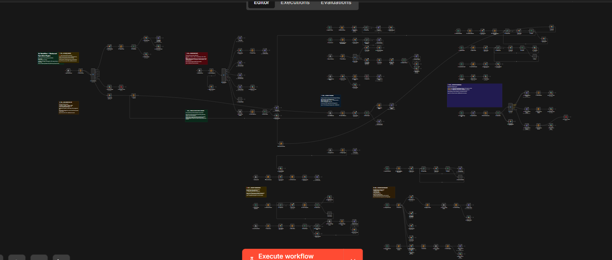
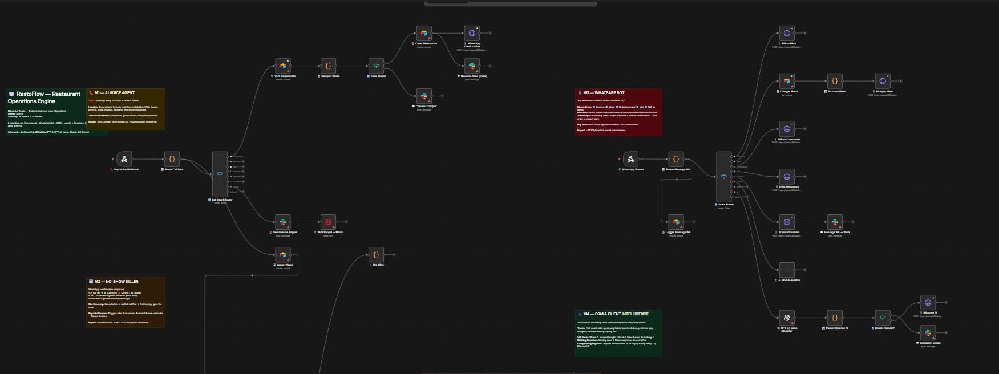
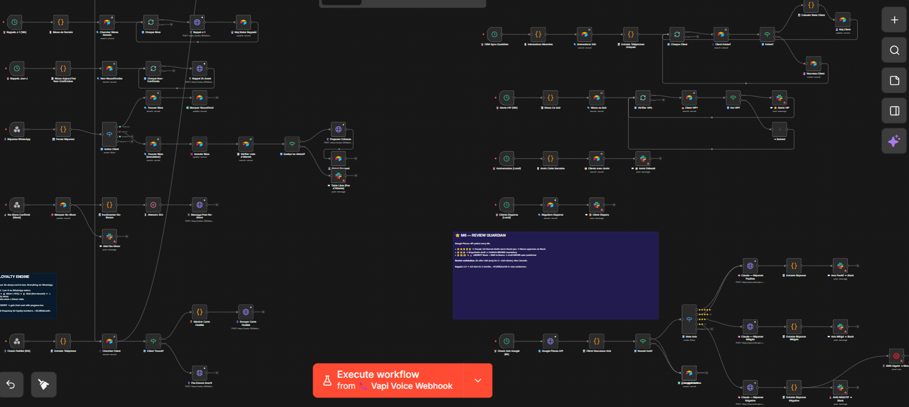
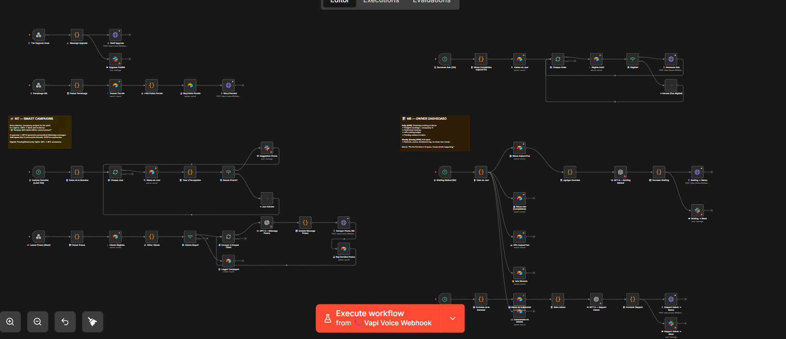

# RestoFlow — Restaurant Operations & Automation Engine

An integrated n8n automation framework for hospitality operations, managing multi-channel reservations, automated table allocation, customer messaging, review aggregation, and loyalty tracking.

Built with a modular architecture to provide real-time event handling, transactional database updates, and multi-channel messaging (WhatsApp, SMS, Email, Telegram).

---

## Overview

RestoFlow automates core front-of-house and back-of-house administrative tasks for food service operations. The system coordinates incoming requests across channels (voice agent, messaging platforms, web forms) and synchronizes state with a centralized CRM database while maintaining human oversight for critical interventions.



---

## Architecture

The system consists of 8 core functional modules:

```
┌────────────────────────────────────────────────────────────────────────┐
│                        RESTOFLOW ARCHITECTURE                          │
├──────────────────────────────────┬─────────────────────────────────────┤
│  CHANNEL & INGESTION             │  OPERATIONS & INTELLIGENCE          │
│                                  │                                     │
│  M1 · AI Voice Ingestion         │  M5 · Digital Loyalty Engine        │
│  M2 · Reservation & No-Show      │  M6 · Review Guardian & Monitoring  │
│  M3 · WhatsApp Conversational Bot│  M7 · Targeted Promotional Engine   │
│  M4 · Client Intelligence & CRM  │  M8 · Daily Executive Dashboard     │
└──────────────────────────────────┴─────────────────────────────────────┘
```

---

## Module Specifications

### M1 — AI Voice Ingestion
Handles inbound voice traffic using conversational AI integration (Vapi/Bland API).
- **Function:** Parses intent (reservation, hours query, menu items, direct transfer request).
- **Execution:** Validates slot availability via database lookup; falls back to staff transfer or callback logging on unhandled edge cases.

### M2 — Reservation & No-Show Prevention
Automates table reservation management and multi-stage reminders.
- **Verification:** Real-time capacity check against active table inventory.
- **Confirmation:** Dispatches immediate multi-channel confirmation (SMS/WhatsApp) with automated cancellation links.
- **Reminders:** Scheduled 24h and 2h reminders with automated slot reallocation on cancellation.

### M3 — WhatsApp Conversational Interface
Provides automated customer interactions over WhatsApp Business API.
- **Capabilities:** Direct table booking, takeout menu queries, feedback submission, and order tracking.
- **Fallback:** Routes complex inquiries or dispute escalations to active staff queues (Slack/Dashboard).



### M4 — Client Intelligence & CRM
Aggregates customer profiles from reservation logs, transaction values, and visit frequencies.
- **Segmentation:** Classifies guests into operational tiers (First-time, Regular, VIP, High No-Show Risk).
- **Data Privacy:** Enforces data retention schedules and anonymization of inactive profiles.

### M5 — Digital Loyalty Engine
Tracks visit counts and spending metrics without physical cards.
- **Trigger:** Post-visit validation by staff.
- **Rewards:** Automatically issues targeted digital vouchers upon reaching defined visit milestones.



### M6 — Review Guardian & Sentiment Monitoring
Aggregates feedback from post-service messaging and external review platforms (Google Places API).
- **Classification:** Categorizes ratings into positive (≥4 stars) vs. negative (≤3 stars).
- **Intervention:** Low scores trigger immediate internal alerts (Slack) for proactive customer service recovery before public posting.

### M7 — Targeted Promotional Engine
Executes automated, segment-specific campaigns during low-occupancy periods (e.g., midweek lunch shifts).
- **Compliance:** Respects opt-out flags and messaging frequency limits to prevent spamming.

### M8 — Executive Daily Briefing
Compiles daily operational metrics at shift end.
- **Outputs:** Total covers, cancellation rate, revenue summary, sentiment breakdown, and stock alert summaries sent directly to management channels.



---

## System Integrations

| Subsystem | Service / API | Function |
|-----------|---------------|----------|
| Database / CRM | Airtable | Table inventory, booking state, customer CRM |
| Messaging | Twilio / WhatsApp API | SMS and WhatsApp transactional messaging |
| Team Comms | Slack | Real-time staff notifications & escalation queues |
| Voice AI | Vapi.ai / Bland.ai | Inbound phone call parsing & booking |
| Review Scraping | Google Places API | External rating monitoring |
| Engine | n8n (Self-hosted) | Event orchestration and state management |

---

## Setup & Deployment

### Prerequisites
- n8n instance (v1.0+)
- Configured credentials for Airtable, Twilio, and target messaging channels

### Installation
1. Open n8n console.
2. Select **Import from File** and upload `RestoFlow-Workflow.json`.
3. Configure environment variables in n8n credential manager.

```env
AIRTABLE_API_KEY=
TWILIO_ACCOUNT_SID=
TWILIO_AUTH_TOKEN=
SLACK_BOT_TOKEN=
GOOGLE_PLACES_API_KEY=
```

---

## Repository Structure

```
restoflow/
├── RestoFlow-Workflow.json      # Primary production workflow (100+ nodes)
├── RestoFlow-Telegram-Demo.json # Lightweight demo workflow
├── README.md                    # Technical documentation
└── assets/                      # Architectural diagrams & canvas captures
```

---

## Author

**Amine Sellal** — Full Stack Developer & AI Automation Engineer  
[github.com/aminesellal](https://github.com/aminesellal) · [Portfolio](https://aminesellal.github.io/myportfolio)
