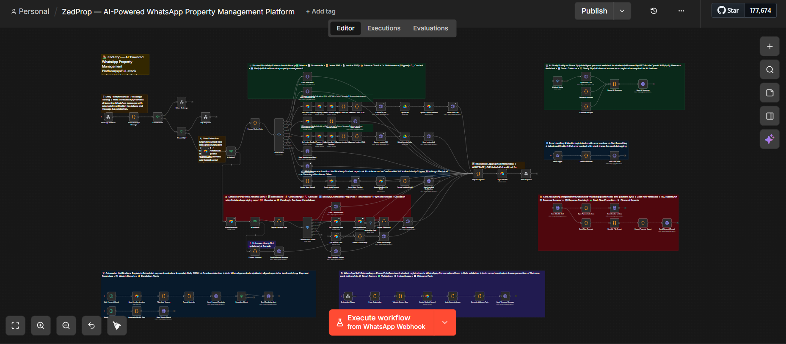
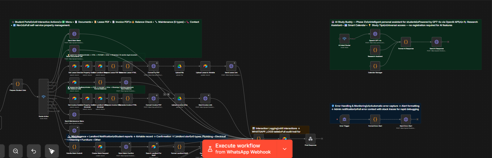
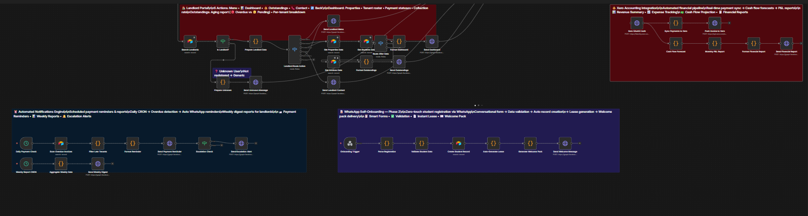
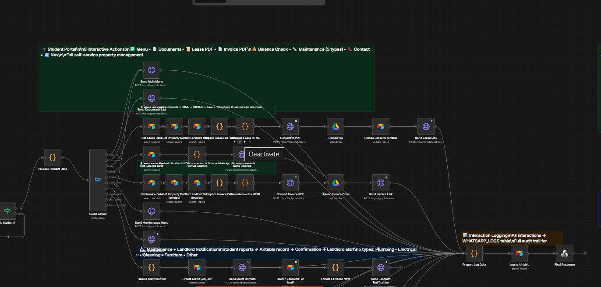

# ZedProp — WhatsApp-Based Property Management System

An event-driven n8n automation system for student housing operations, providing tenants with a fully self-service WhatsApp interface for lease access, payment status, invoice retrieval, and maintenance requests — without any custom application development.

---

## System Overview

ZedProp replaces manual property management workflows with a single unified n8n pipeline triggered by WhatsApp webhooks. Tenant interactions are processed, routed, and responded to automatically, with all state managed in a centralized Airtable database.



---

## Architecture

```
┌────────────────────────────────────────────────────────────┐
│                  ZEDPROP — CORE PIPELINE                   │
├────────────────────────────────────────────────────────────┤
│                                                            │
│  WhatsApp Webhook                                          │
│         │                                                  │
│         ▼                                                  │
│  Message Parser                                            │
│  (extract phone, type, action_id)                         │
│         │                                                  │
│         ▼                                                  │
│  Tenant Lookup → Airtable                                  │
│  (match by phone number)                                   │
│         │                                                  │
│         ▼                                                  │
│  Action Router (Switch — 7 branches)                       │
│  ├── VIEW_LEASE    → Fetch data → HTML render → PDF → Send│
│  ├── RENT_STATUS   → Query balance → Format → Reply       │
│  ├── GET_INVOICE   → Fetch invoice record → Send PDF      │
│  ├── MAINTENANCE   → Create ticket → Confirm → Log        │
│  ├── CONTACT       → Send static contact card             │
│  ├── MENU          → Send interactive list message        │
│  └── UNKNOWN       → Fallback reply + re-prompt menu      │
│         │                                                  │
│         ▼                                                  │
│  Interaction Logger → Airtable (all events)               │
│                                                            │
└────────────────────────────────────────────────────────────┘
```

---

## Subsystem Details

### Webhook Ingestion & Meta Verification
Validates the WhatsApp Cloud API webhook signature (HMAC-SHA256) before processing. Handles both verification handshake and payload ingestion in a single webhook node.

### Tenant Lookup
Performs an exact-match search against the `Tenants` table using the sender's phone number (E.164 format). Unauthenticated numbers receive a structured error response without any data exposure.



### Action Router — 7 Branch Switch Node
Routes validated tenant requests to the corresponding handler based on parsed `action_id`. Provides a strict exhaustive handler with a dedicated fallback branch for unrecognized inputs.

### Lease PDF Generation Pipeline
Dynamically generates lease agreements on-demand:
1. Fetches tenant and property data from Airtable.
2. Injects data into a parameterized HTML template.
3. Converts to PDF via `html2pdf.app` API.
4. Uploads PDF to WhatsApp Cloud API media endpoint.
5. Sends document message with filename and caption.



### Maintenance Ticket System
Creates structured maintenance records in Airtable with timestamp, tenant reference, unit ID, and free-text issue description. Returns a confirmation message with a generated ticket reference number.

### Interaction Logger
Appends a record for every processed message to the `Interactions` table regardless of branch outcome. Fields include: tenant ID, action type, response status, processing duration, and timestamp.



---

## Database Schema (Airtable — 8 Tables)

| Table | Key Fields | Purpose |
|-------|-----------|---------|
| `Tenants` | phone, name, unit_id, lease_id, balance | Core tenant registry |
| `Units` | unit_id, property_id, floor, surface_m2 | Property inventory |
| `Leases` | lease_id, tenant_id, start_date, end_date, monthly_rent | Active lease contracts |
| `Invoices` | invoice_id, tenant_id, amount, due_date, status | Monthly invoice records |
| `Payments` | payment_id, tenant_id, amount, date, method | Payment transaction log |
| `Maintenance` | ticket_id, tenant_id, description, status, created_at | Maintenance requests |
| `Interactions` | tenant_id, action_type, status, timestamp | Audit log |
| `Properties` | property_id, address, owner_id, total_units | Property metadata |

---

## Integration Stack

| Service | Role |
|---------|------|
| **WhatsApp Cloud API (Meta)** | Bidirectional messaging channel |
| **Airtable** | Primary relational database & state engine |
| **html2pdf.app API** | Server-side HTML-to-PDF conversion |
| **n8n (Self-hosted)** | Workflow orchestration engine |
| **ngrok / Cloudflare Tunnel** | Webhook exposure for self-hosted deployment |

---

## Setup & Configuration

### Prerequisites
- Self-hosted n8n instance (v1.0+)
- WhatsApp Cloud API access (Meta Business Suite)
- Airtable workspace with ZedProp schema

### Installation Steps
1. Import `ZedProp-Unified-Workflow.json` into n8n.
2. Configure credentials: Airtable API token, WhatsApp HTTP Header Auth (Bearer token).
3. Set n8n environment variables (Settings → Variables).
4. Expose n8n webhook port via `ngrok http 5678` or equivalent tunnel.
5. Register webhook URL in Meta WhatsApp Business Dashboard.

### Environment Variables

| Variable | Description |
|----------|-------------|
| `AIRTABLE_BASE_ID` | Airtable base identifier |
| `WHATSAPP_PHONE_NUMBER_ID` | WhatsApp sender phone ID |
| `HTML2PDF_API_KEY` | html2pdf.app API key |
| `N8N_WEBHOOK_URL` | Public webhook URL (ngrok / Cloudflare) |

---

## File Manifest

| File | Description |
|------|-------------|
| `ZedProp-Unified-Workflow.json` | Primary n8n workflow export |
| `ZedProp-Telegram-Demo.json` | Telegram-adapted demonstration variant |
| `README.md` | System architecture & deployment documentation |
| `assets/canvas-full.png` | Full n8n canvas capture |
| `assets/canvas-part1.png` | Webhook ingestion & routing detail |
| `assets/canvas-part2.png` | PDF generation pipeline detail |
| `assets/canvas-part3.png` | Logging & maintenance system detail |

---

## Author

**Amine Sellal** — Full Stack Developer & AI Automation Engineer  
[github.com/aminesellal](https://github.com/aminesellal) · [Portfolio](https://aminesellal.github.io/myportfolio)
